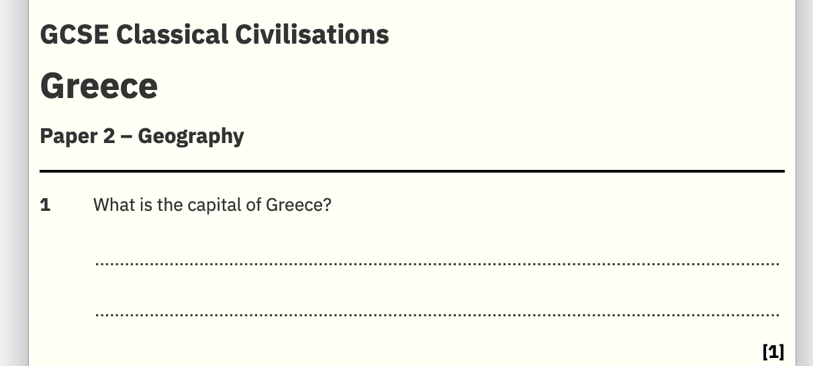

# paper.css

Stylesheet for marking up question papers.

A complete example can be found <a href="index.html">in the repository</a> and <a href="https://ωωω.χαίρετε.ελ/paper/">also online</a>.


```HTML
<link rel="stylesheet" href="https://ωωω.χαίρετε.ελ/paper.css"></link>
<script src="https://ωωω.χαίρετε.ελ/paper.js"></script>
  
<div class="paper">
  <header>
    <h2>GCSE Classical Civilisations</h2>
    <h1>Greece</h1>
    <h3>Paper 2 – Geography</h3>
  </header>
  <main>
    <section>
      What is the capital of Greece?
      <textarea rows=2></textarea>
      <mark>1</mark>
    </section>
  </main>
</div>
```



